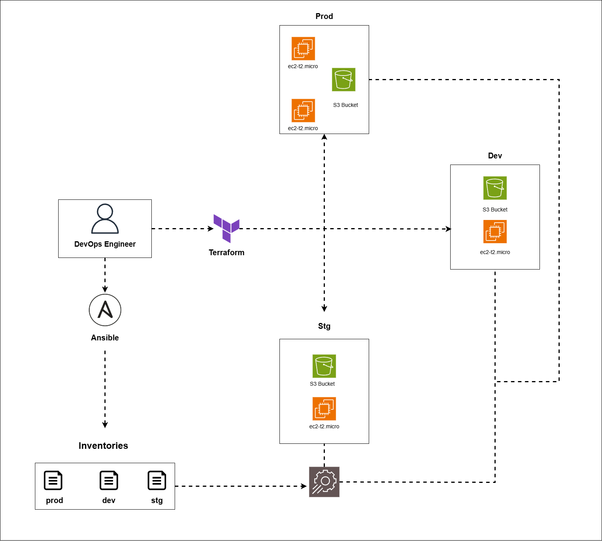

# Multi-Environment Infrastructure Deployment with Terraform & Ansible

This project automates the provisioning and configuration of multi-environment infrastructure using **Terraform** (for infrastructure provisioning) and **Ansible** (for server configuration).  
It supports **Development**, **Staging**, and **Production** environments.




---

## 📦 Prerequisites

Before starting, make sure you have the following installed:

### 1️⃣ Install Terraform
**For Linux:**
```bash
sudo apt update && sudo apt install -y gnupg software-properties-common curl
curl -fsSL https://apt.releases.hashicorp.com/gpg | sudo gpg --dearmor -o /usr/share/keyrings/hashicorp-archive-keyring.gpg
echo "deb [signed-by=/usr/share/keyrings/hashicorp-archive-keyring.gpg] https://apt.releases.hashicorp.com $(lsb_release -cs) main" | sudo tee /etc/apt/sources.list.d/hashicorp.list
sudo apt update && sudo apt install terraform
```

**For Windows:**
1. Download from: [https://developer.hashicorp.com/terraform/downloads](https://developer.hashicorp.com/terraform/downloads)
2. Add Terraform binary to your **PATH**.

---

### 2️⃣ Install Ansible
**For Linux:**
```bash
sudo apt update && sudo apt install -y ansible
```

**For macOS (Homebrew):**
```bash
brew install ansible
```

**For Windows:**
> Install Ansible inside **WSL (Ubuntu)**:
```bash
sudo apt update && sudo apt install -y ansible
```

---

## 🚀 Deploy Infrastructure with Terraform

1. **Navigate to the Terraform directory:**
```bash
cd Terraform
```

2. **Initialize Terraform:**
```bash
terraform init
```

3. **Deploy infrastructure:**
```bash
terraform apply
```

5. After the deployment, note the **public IPs** of your EC2 instances from Terraform output.

---

## 🔧 Update Ansible Inventory with EC2 IPs

After Terraform deploys your infrastructure, you need to update the Ansible inventory files with your new EC2 IP addresses.

Inventory files are located at:
```
Ansible/inventory/multi-env/dev
Ansible/inventory/multi-env/stg
Ansible/inventory/multi-env/prod
```

Example (update with actual IP):
```ini
[web]
<YOUR_EC2_PUBLIC_IP> ansible_user=ubuntu ansible_ssh_private_key_file=~/.ssh/key-pair-for-TAME
```

---

## 🛠 Run Ansible Playbook

1. **Navigate to Ansible playbook directory:**
```bash
cd Ansible/playbook
```

2. **Run playbook for specific environment (example: `prod`):**
```bash
ansible-playbook -i ../inventory/multi-env/prod playbook.yml
```

For `dev`:
```bash
ansible-playbook -i ../inventory/multi-env/dev playbook.yml
```

For `stg`:
```bash
ansible-playbook -i ../inventory/multi-env/stg playbook.yml
```

---

## 📂 Project Structure

```
.
├── Ansible
│   ├── inventory
│   │   └── multi-env
│   │       ├── dev
│   │       ├── prod
│   │       └── stg
│   └── playbook
│       ├── playbook.yml
│       └── roles
│           └── nginx-role
│               ├── defaults
│               ├── files
│               ├── handlers
│               ├── meta
│               ├── tasks
│               ├── templates
│               ├── tests
│               └── vars
└── Terraform
    ├── AWS-infra
    ├── main.tf
    ├── variables.tf
    ├── provider.tf
    ├── output.tf
    └── terraform.tfstate.d
```

---

## ✅ Workflow Summary

1. Install **Terraform** & **Ansible**.
2. Use Terraform to create infrastructure in desired environment.
3. Copy EC2 public IPs to Ansible inventory files.
4. Run the Ansible playbook to configure servers.

---
